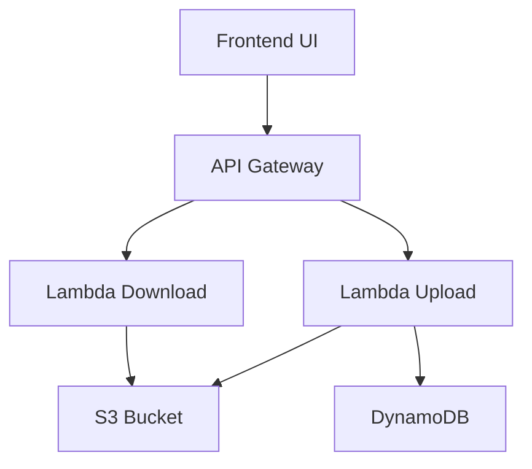

# 🚀 Secure File Upload & Sharing System (AWS Serverless)


---

## 🌐 Overview

A full-stack serverless application that allows users to upload and download files securely using AWS services.

This project demonstrates real-world cloud architecture using pre-signed URLs for secure file transfer without exposing backend servers.

---

## ✨ Features

- 📤 Secure file upload using pre-signed URLs
- 📥 Temporary secure download links
- ⚡ Fully serverless backend
- 🗂 Metadata stored in DynamoDB
- 🌍 REST APIs with API Gateway
- 💻 Clean frontend UI (HTML, CSS, JS)

---

## 🏗️ Architecture


## 🛠️ Tech Stack

| Layer      | Technology         |
|-----------|-------------------|
| Frontend  | HTML, CSS, JS     |
| Backend   | AWS Lambda        |
| API Layer | API Gateway       |
| Storage   | Amazon S3         |
| Database  | DynamoDB          |

📤 Upload

POST /upload

Returns a pre-signed URL to upload file.

{
  "uploadURL": "...",
  "file_id": "uuid"
}

📥 Download

GET /download?file_id=YOUR_FILE_ID

Returns secure download link.

{
  "downloadURL": "..."
}
## 📂 Project Structure

```
s3-secure-upload-system/
│
├── lambda/
│   ├── upload.py
│   └── download.py
│
├── public/
│   └── index.html
│
├── screenshots/
├── README.md
└── .gitignore
```


📸 Screenshots
🔹 UI

Add your UI screenshot here

🔹 Upload Success

Add upload response screenshot

🔹 Download Link

Add download working screenshot

⚙️ How It Works
User selects file from frontend
API Gateway calls Lambda
Lambda generates pre-signed URL
File uploads directly to S3
Metadata stored in DynamoDB
Download API returns secure access link
🔐 Security
Pre-signed URLs (time-limited access)
No direct backend file handling
IAM-based access control
🚀 Future Enhancements
🔐 User authentication (JWT / Cognito)
📊 Upload progress bar
📁 Multiple file types support
🌍 Deploy frontend on S3 (static hosting)
📦 File size & type validation

⭐ Show Your Support

If you like this project, give it a ⭐ on GitHub!
